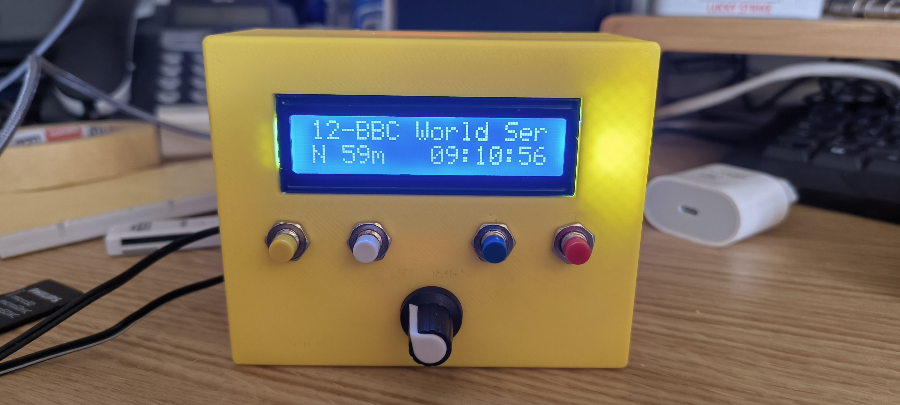
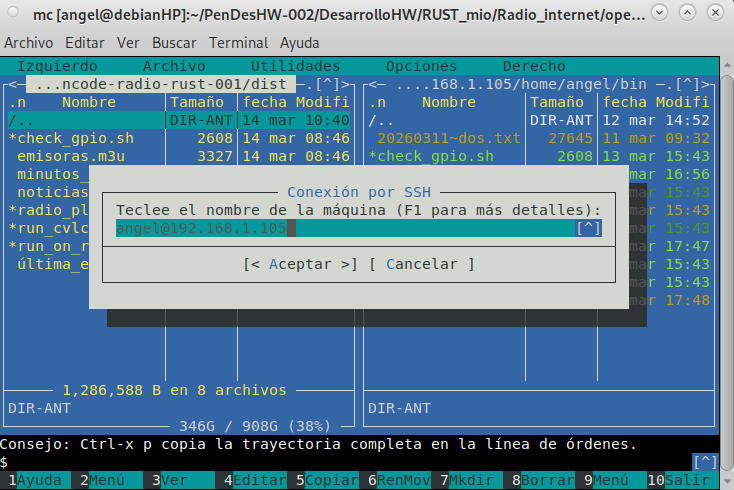
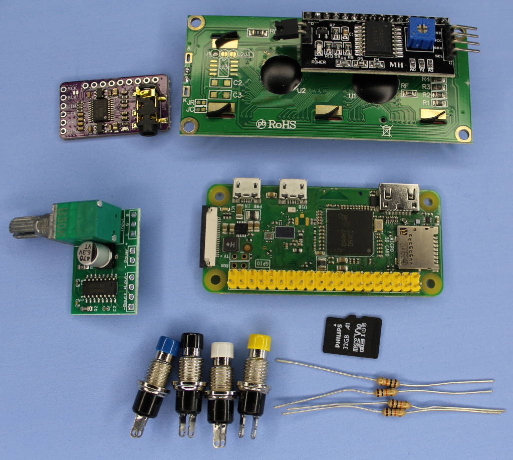
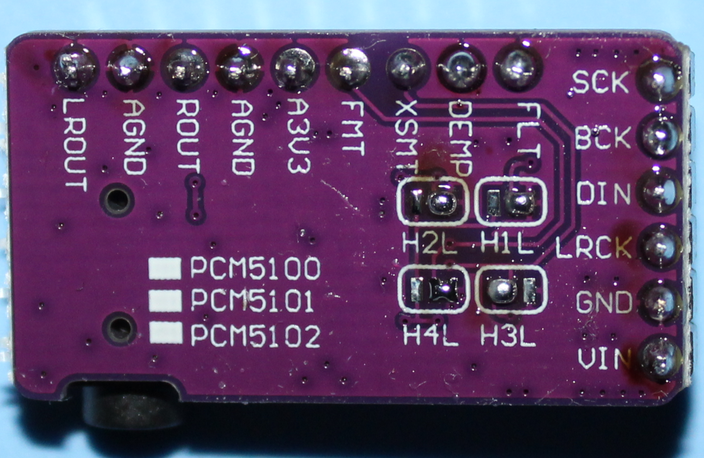
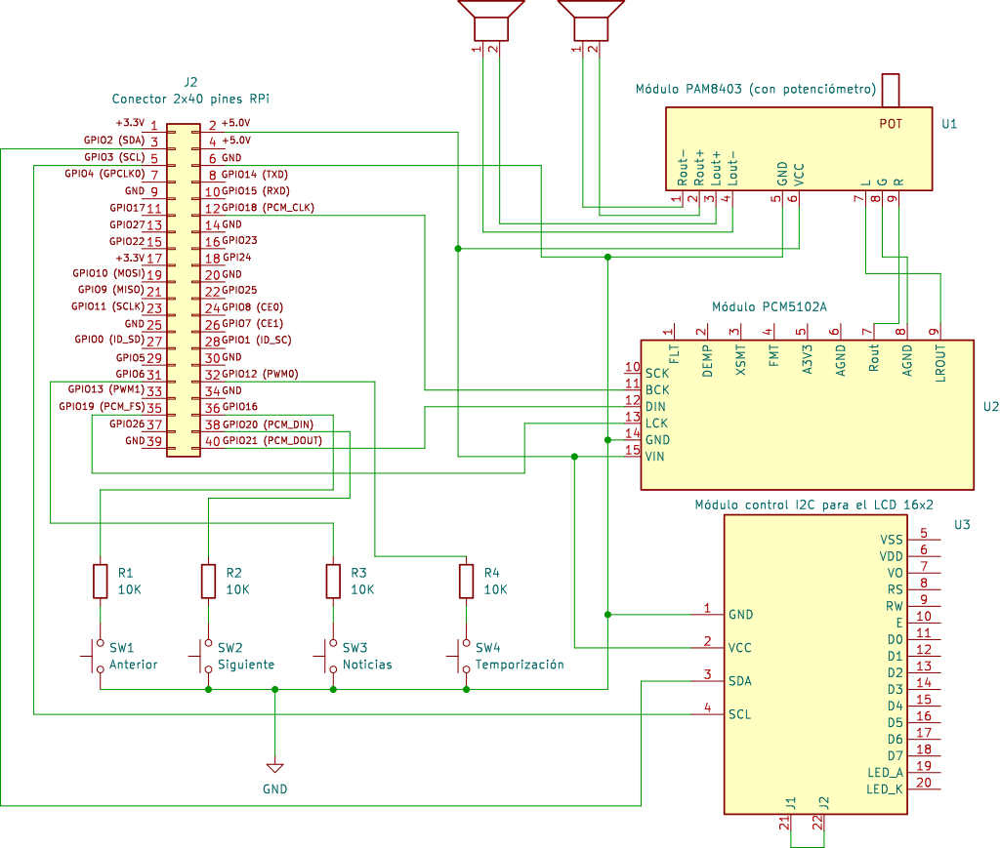

# Radio Internet - RPi Zero

**Angel de la Iglesia Gonzalo**

**Versión/rev**: 1/2

**Fecha**:20250402

**Abstract**: This project is for building an internet radio using a *Raspberry Pi Zero* board and a program written in *rust* to control the *RPi*, a DAC converter, and a 16-column, 2-row display. The amplifier uses a *PAM8403-Amp3W* module with a potentiometer. [*VLC*](https://images.videolan.org/vlc/index.es.html) is used for playing radio stations.


**Resumen**: En este proyecto se construye un aparato de radio por internet con una tarjeta *Raspberri Pi Zero* y un programa escrito en *rust* para controlar la *RPi*, un convertidor *DAC* y un *display* de 16 columnas y dos filas. Para el amplificador se usa el módulo *PAM8403-Amp3W* con potenciómetro. Para la reproducción de las emisoras se utiliza [*VLC*](https://images.videolan.org/vlc/index.es.html).

**Licencia**: Este proyecto esta bajo la Licencia [MIT](https://opensource.org/license/mit).




Este proyecto se ha generado con la ayuda [*Opencode*](https://opencode.ai/) y [*OpenCode Zen Big Pickle*](https://opencode.ai/docs/zen/).


## Apartados principales
- [Radio Internet - RPi Zero](#radio-internet---rpi-zero) (Repositorio Github)
- [Configuración de la tarjeta *microSD* para la radio de internet](#configuración-de-la-tarjeta-microsd-para-la-radio-de-internet)
- [El Hardware](#el-hardware)
- [Consideraciones sobre el software del proyecto](#consideraciones-sobre-el-software-del-proyecto)


**NOTA**: Para la lectura *off-line* puedes ver este fichero en *pdf* con *README.pdf* y en *html* con *README.html*. Este último fichero, si lo abres en un navegador, es el más cómodo para copiar y luego pegar en los ficheros de la *RPi Zero*.

## Requisitos Previos

Para construir el programa es conveniente realizar la compilación en un sistema de escritorio ya que la *RPi Zero* es muy lenta para la compilación (pero es capaz de hacerla sin problemas). Para ello es necesario disponer un sistema de desarrollo que nos permita la compilación cruzada.

### Paquetes a instalar en Debian 13 (64 bits)

**1. Rust**

La instalación de [rust](https://rust-lang.org/es/tools/install/) se hace con:

```sh
curl --proto '=https' --tlsv1.2 -sSf https://sh.rustup.rs | sh
source ~/.cargo/env
```

**2. Herramientas de compilación cruzada para ARM**

Para la compilación en un sistema *AMD* de 64 bits para un sistema *ARM* de 32 bits necesitamos:

```sh
sudo apt install -y gcc-arm-linux-gnueabihf g++-arm-linux-gnueabihf \
libc6-dev-armhf-cross
```

**3. Instalar y configurar Docker**

Instalar desde repositorios Debian: 
 
```sh
sudo apt install -y docker.io docker-compose
```

Añadir usuario al grupo docker 

```sh
sudo usermod -aG docker $USER
```

Iniciar y habilitar Docker 

```sh
sudo systemctl enable --now docker
```

Cierra y vuelve a abrir la sesión (o ejecuta `newgrp docker`)

Verificar                                                                                                          

```sh
docker run hello-world
```

Si está bien instalado verás un mensaje largo que empieza con algo semejante a:

```sh
Hello from Docker!
This message shows that your installation appears to be working correctly.
...
...
...
```

**4. Intalar QEMU**

Es necesario para emular binarios ARM durante la compilación.

```sh
sudo apt install -y qemu-user qemu-user-static binfmt-support
```

**5. Agregar target de Rust**

Para añadir el *target*:

```sh
rustup target add arm-unknown-linux-gnueabihf
```

**6. Instalar cross** 

Es la herramienta de compilación cruzada:

```bash
cargo install cross
```


### Instalación y Compilación del programa de radio

1. Clona este repositorio:

```sh
git clone https://github.com/aig-microC/Radio_Internet_RPiZero_rust
   
cd Radio_Internet_RPiZero_rust
```

2. Compila el proyecto con el guión *build_for_rpi.sh*:

```bash
./build_for_rpi.sh
```

- El ejecutable se generará en: `target/arm-unknown-linux-gnueabihf/release/radio_player`. El ejecutable se llama **radio_player**.

Los ficheros que deberás copiar a un subdirectorio de la *RPi Zero* están en el subdirectorio *dist* que se ha generado con el *guión* anterior.

Ten en cuenta que para que el programa funcione correctamente, **debes situar los siguientes archivos en el mismo subdirectorio que el ejecutable**:

- **emisoras.m3u**: Lista de emisoras en formato M3U. Se extrae el nombre tras #EXTINF:-1,.
- **noticias.m3u**: Contiene una única *URL* para la emisora de noticias.
- **minutos_noticias.txt**: Linea 1 (inicio), Linea 2 (fin).
- **ultima_estacion.txt**: El programa guarda aquí el índice de la ultima radio escuchada.

En el subdirectorio *dist* también hay unos guiones de *bash* que se pueden utilizar para la depuración.

Al ejecutar *build_for_rpi.sh* deberás tener una salida parecida a:

```sh
 ./build_for_rpi.sh 
Compilando para Raspberry Pi Zero (arm-unknown-linux-gnueabihf)...
Limpiando compilaciones anteriores...
info: syncing channel updates for stable-x86_64-unknown-linux-gnu

  stable-x86_64-unknown-linux-gnu unchanged - rustc 1.94.0 (4a4ef493e 2026-03-02)

info: checking for self-update (current version: 1.29.0)
[cross] note: Falling back to `cargo` on the host.
     Removed 314 files, 80.3MiB total
Compilando para arm-unknown-linux-gnueabihf...
info: syncing channel updates for stab*build_for_rpi.sh*le-x86_64-unknown-linux-gnu

  stable-x86_64-unknown-linux-gnu unchanged - rustc 1.94.0 (4a4ef493e 2026-03-02)

info: checking for self-update (current version: 1.29.0)
   Compiling libc v0.2.180
   Compiling proc-macro2 v1.0.106
   Compiling quote v1.0.44
   Compiling unicode-ident v1.0.22
   Compiling parking_lot_core v0.9.12
   Compiling syn v2.0.114
   Compiling uninitialized v0.0.2
   Compiling serde_core v1.0.228
   Compiling cfg-if v1.0.4
   Compiling smallvec v1.15.1
   Compiling scopeguard v1.2.0
   Compiling lock_api v0.4.14
   Compiling errno v0.3.14
   Compiling serde v1.0.228
   Compiling bitflags v1.3.2
   Compiling byteorder v1.5.0
   Compiling i2c-linux-sys v0.2.1
   Compiling signal-hook-registry v1.4.8
   Compiling resize-slice v0.1.3
   Compiling serde_derive v1.0.228
   Compiling tokio-macros v2.6.0
   Compiling parking_lot v0.12.5
   Compiling socket2 v0.6.2
   Compiling mio v1.1.1
   Compiling pin-project-lite v0.2.16
   Compiling bytes v1.11.0
   Compiling tokio v1.49.0
   Compiling i2c-linux v0.1.2
   Compiling rppal v0.17.1
   Compiling bitflags v2.10.0
   Compiling radio_player v5.4.3 (/project)
    Finished `release` profile [optimized] target(s) in 50.85s
¡Compilación exitosa!
Ejecutable generado: target/arm-unknown-linux-gnueabihf/release/radio_player
Ficheros copiados al directorio 'dist/'
Contenido del directorio dist:
total 1288
drwxrwxr-x 2 usuario usuario    4096 mar 14 08:47 .
drwxrwxr-x 9 usuario usuario    4096 mar 14 11:43 ..
-rwxrwxr-x 1 usuario usuario    2608 mar 14 11:44 check_gpio.sh
-rw-rw-r-- 1 usuario usuario     937 mar 14 11:44 emisoras.m3u
-rw-rw-r-- 1 usuario usuario       7 mar 14 11:44 minutos_noticias.txt
-rw-rw-r-- 1 usuario usuario     252 mar 14 11:44 noticias.m3u
-rwxr-xr-x 1 usuario usuario 1278508 mar 14 11:44 radio_player
-rwxrwxr-x 1 usuario usuario     578 mar 14 11:44 run_cvlc.sh
-rwxrwxr-x 1 usuario usuario    1305 mar 14 11:44 run_on_rpi.sh
-rw-rw-r-- 1 usuario usuario       3 feb  9 09:31 última_estación.txt

Configuración:
  - Botón siguiente: GPIO 20 (pin 38)
  - Botón anterior: GPIO 16 (pin 36)
  - Botón temporizador: GPIO 12 (pin 32)
  - Botón noticias: GPIO 6 (pin 31)
  - LCD1602: SDA → GPIO 2 (pin 3), SCL → GPIO 3 (pin 5)
  - Todos con pull-up interno
  - cvlc ejecutado como usuario normal via wrapper
  - Para cambiar los pines, modificar constantes en src/main.rs
```

### Prueba del binario ARM con QEMU 

Esto es opcional y si no conoces **QEMU** y los comandos utilizados para depuración puede que no te sirva de mucho. Yo lo he utilizado para la depuración del programa con *Opencode*. Como el programa presentado funciona correctamente las salidas de error no son aplicables.

**Verificación básica**

Ejecutar el binario compilado para Raspberry Pi Zero:

```bash
qemu-arm -L /usr/arm-linux-gnueabihf dist/radio_player
```
*Salida esperada:*

En mi sistema de desarrollo tengo instalado `VLC` y al ejecutar el comando oigo una emisora. Esto significa que el binario funciona correctamente. El programa:

1. Encontró emisoras.m3u
2. Inicializó el LCD (aunque falló, continuó)
3. Arrancó cvlc para reproducir la radio
4. El audio sale por los altavoces

Para detenerlo, presiona *CTRL c*.

Puede que obtengas:

```sh
qemu: fatal: Unknown hardware entity
```

O bien:

```sh
Error opening GPIO: IoError
Error opening I2C: No such file or directory
```

**Explicación:** 

El programa intentará inicializar *GPIO* e *I2C* y fallará porque el *host* no tiene ese hardware. Esto es normal y esperado. En mi sistema no se produce.

**Ver con strace**

Ver las *syscalls* que intenta ejecutar:

```bash
qemu-arm -strace -L /usr/arm-linux-gnueabihf dist/radio_player \
2>&1 | head -100
```
*Salida esperada:*

Algo parecido a:

```
4980 brk(NULL) = 0x004f1000
4980 mmap2(NULL,8192,PROT_READ|PROT_WRITE,MAP_PRIVATE|MAP_ANONYMOUS,-1,0) = 0x40802000
4980 access("/etc/ld.so.preload",R_OK) = -1 errno=2 (No such file or directory)
4980 openat(AT_FDCWD,"/etc/ld.so.cache",O_RDONLY|O_LARGEFILE|O_CLOEXEC) = 3
4980 statx(3,"",AT_EMPTY_PATH|AT_NO_AUTOMOUNT|AT_STATX_SYNC_AS_STAT,STATX_BASIC_STATS,0x407ff190) = 0
4980 mmap2(NULL,146779,PROT_READ,MAP_PRIVATE,3,0) = 0x40841000
4980 close(3) = 0
4980 openat(AT_FDCWD,"/lib/arm-linux-gnueabihf/libgcc_s.so.1",O_RDONLY|O_LARGEFILE|O_CLOEXEC) = -1 errno=2 (No such file or directory)
4980 statx(AT_FDCWD,"/lib/arm-linux-gnueabihf/",AT_NO_AUTOMOUNT|AT_STATX_SYNC_AS_STAT,STATX_BASIC_STATS,0x407ff120) = 0
4980 openat(AT_FDCWD,"/usr/lib/arm-linux-gnueabihf/libgcc_s.so.1",O_RDONLY|O_LARGEFILE|O_CLOEXEC) = -1 errno=2 (No such file or directory)
4980 statx(AT_FDCWD,"/usr/lib/arm-linux-gnueabihf/",AT_NO_AUTOMOUNT|AT_STATX_SYNC_AS_STAT,STATX_BASIC_STATS,0x407ff120) = 0
4980 openat(AT_FDCWD,"/lib/libgcc_s.so.1",O_RDONLY|O_LARGEFILE|O_CLOEXEC) = 3
4980 read(3,0x407ff3e0,512) = 512
4980 statx(3,"",AT_EMPTY_PATH|AT_NO_AUTOMOUNT|AT_STATX_SYNC_AS_STAT,STATX_BASIC_STATS,0x407ff118) = 0
4980 mmap2(NULL,262448,PROT_NONE,MAP_PRIVATE|MAP_ANONYMOUS|MAP_DENYWRITE,-1,0) = 0x40865000
4980 mmap2(0x4
...
```

Busca estas *syscalls* importantes:

- `open` - abriendo archivos de configuración
- `ioctl` - fallando al acceder a GPIO/I2C (valor -1 con ENOTTY o ENOENT)
- `write` - mostrando mensajes por pantalla

*Error esperado:*
```
ioctl(...) = -1 ENOTTY
ioctl(...) = -1 ENOENT
```

Para detenerlo, presiona *TRL c*.

**Capturar errores**

```bash
qemu-arm -L /usr/arm-linux-gnueabihf dist/radio_player 2>&1 | \
grep -i "error\|cannot\|failed"
```

En mi sistema se oye una emisora (cuando el programa funciona correctamente) y no presenta ningún mensaje.

Para detenerlo, presiona *CTRL c*.


**Verificar binario**

```bash
file dist/radio_player
```
*Salida esperada:*

```bash
dist/radio_player: ELF 32-bit LSB executable, ARM, EABI5 version 1 (SYSV),
dynamically linked, interpreter /lib/ld-linux-armhf.so.3,
for GNU/Linux 3.2.0, stripped
```

Debe mostrar `ELF 32-bit LSB executable, ARM`.

**Verificar dependencias**

```bash
qemu-arm -L /usr/arm-linux-gnueabihf -strace dist/radio_player \
2>&1 | head -50
```
*Salida esperada:* 

Lista de *syscalls* similares a la salida con *strace*.


> **Notas**:

> - La verificación real del hardware (*GPIO*, *LCD1602*) solo es posible en la *Raspberry Pi* física
> - *QEMU user-mode* solo puede verificar que el binario se carga y ejecuta hasta necesitar *hardware* real

**Resumen**

| Comando | Resultado Esperado |
|---------|----------|
| `file` | ELF 32-bit ARM |
| Ejecución | Error de GPIO/I2C |
| strace | Syscalls de apertura de archivos, ioctl fallando |
| grep errores | "Error opening GPIO/I2C" |

*La prueba es exitosa si:*

- El binario es reconocido como *ARM*.
- El programa inicia y rechaza hasta necesitar hardware físico
- Los errores son solo de *GPIO/I2C* (no errores de *linking* o dependencias).

# Configuración de la tarjeta *microSD* para la radio de internet

## 1 - Descarga de la imagen y grabación en la tarjeta

Utilizar [*RPi Imager*](https://www.raspberrypi.com/software/).

En *dispositivo* seleccionar:

- Pi Raspberry Zero.
- Raspberry Pi OS (other).
- Raspberry Pi PS Lite (32-bit).
- **¡¡¡Cuidado!!! Selecciona la microSD para el proyecto. Puedes destruir tu disco duro u otro disco si no seleccionas la tarjeta correctamente**. Seleccionar el dispositivo de almacenamiento (la tarjeta *microSD*).
- Seguir las instrucciones:
    - Para el nombre del equipo.
    - Localización.
    - Nombre de usuario y contraseña.
    - Wifi, Red segura.
    - Activar SSH.
        - Usar autenticación por contraseña.
- Resumen / Escribir (para grabar la imagen en la SD). 
 

## 2 - Configuración inicial tras el primer arranque

El primer arranque tarda significativamente más tiempo que los arranques sucesivos ya que, entre otras cosas, hace la ampliación del espacio libre disponible en la *microSD*. 

### 2.1 - Conexión desde el *PC* de desarrollo con la *RPi Zero*

Si no tienes instalado *nmap* hay que instalar el paquete.

```sh
sudo apt install nmap
```
Para saber la *IP* de tu *PC* de desarrollo teclea:

```sh
hostname -I  
192.168.1.109
```
En mi caso la dirección *IP* de mi *PC* de desarrollo es `192.168.1.109`

Usar `nmap` para detectar la *IP* local de la *RPi Zero*.

```sh
nmap -sP 192.168.1.1-255
```
Se lanza al principio, justo antes de alimentar la *RPi*, para ver los equipos conectados y pasados unos minutos de la alimentación (en mi caso fueron 5 minutos) se repite para ver si aparece la *RPi Zero*.

```sh
nmap -sP 192.168.1.1-255
...
Nmap scan report for RPizero.home (192.168.1.105)
...
```
A continuación conectamos:

```sh
ssh usuario@192.168.1.105
```
Donde `usuario` es el nombre de usuario que pusiste al definir el *Nombre de usuario y contraseña* cuando utilizaste *RPi Imager*.

> **NOTA**: Al hacer el `SSH` hay que introducir la *password*.


### 2.2 - Actualización del sistema

```sh
sudo apt update
sudo apt full-upgrade -y
```

Si no escribes la opción `-y` deberás decir `y` o pulsar `Enter` cada vez que el programa de actualización te pregunte, ya que `y` es la opción por defecto para que actualice los paquetes.

El tiempo que dura la actualización depende del desfasaje entre la imagen del *SO* para la *microSD* y la evolución de la distribución.

> **NOTA**: Aunque configuré el idioma no ha configurado las *locales*. Para configurar las *locales* hago lo siguiente:

```sh
sudo dpkg-reconfigure locales
```
Y  selecciono:

-`[*] es_ES.UTF-8 UTF-8` 

Y para *Default locale* selecciono: `es_ES.UTF-8` 


### 2.2.1 - Instalación de paquetes necesarios

```sh
sudo apt install vim vlc i2c-tools -y
```
`vim` es mi editor preferido de consola. Si tu prefieres `nano`, ya está instalado.

### 2.3 - Configuración para entrada automática (*auto Login*)

Hacemos:

```sh
sudo raspi-config
```

Y seleccionar:

```sh
- 1 System Options
    - S6 Auto Login
```

### 2.4 - Configuración para el *DAC* y el *LCD*

Volvemos atrás y seguimos navegando en `raspi-config` y  seleccionamos:

```sh
- 3 Interface Options   Configure connections to peripherals 
    - I5 I2C   Enable/disable automatic loading of I2C kernel module 
```

**2.4.1 Inhabilitar el dispositivo de sonido en la _RPi_**

Lo primero es poner en la *lista negra del núcleo* el módulo de sonido de nuestra tarjeta *RPi*. Para ello editamos, con `sudo`: 

```bash
sudo vi /etc/modprobe.d/alsa-blacklist.conf
```

y añadimos el siguiente contenido en el fichero:

```Bash
	blacklist snd_bcm2835
```

Con esto conseguimos que no se cargue en el arranque del kernel de *Linux* el módulo `snd_bcm2835` al meterlo en una lista negra ([blacklist](https://wiki.debian.org/KernelModuleBlacklisting)).


**2.4.2 - Configurar I2C Dual (DAC + LCD1602)**

Editar la configuración de `/boot/firmware/config.txt`

```bash
sudo vi /boot/firmware/config.txt
```

Añadir/modificar las líneas siguientes:

```bash
dtparam=i2s=on
dtoverlay=hifiberry-dac
dtoverlay=i2c1          # Activar segundo bus I2C para LCD1602
dtparam=audio=off
hdmi_drive=2
```
**2.4.3 -  Configuración Audio _RPi_**

Editar /etc/asound.conf
```bash

sudo vi /etc/asound.conf

pcm.!default {
    type hw
    card 0
    device 0
}
ctl.!default {
    type hw
    card 0
}
```

A continuación hacemos un *reboot*

```sh
sudo reboot
```
y entraremos directamente al hacer:

```sh
ssh usuario@192.168.1.105
```
> **NOTA**: Al hacer el `SSH` hay que introducir la *password*.


## 3 - Configuración del programa de radio y el sistema


### 3.1 - Modificación de *.bashrc* y creación de *~/.bin*

Para crear un subdirectorio donde pondremos los ejecutables pondremos al final del fichero *.bashrc* la línea:


```sh
PATH="$HOME/bin:$PATH"
```
Una vez guardado el fichero, para que la modificación tome efecto, hacer:

```sh
source .bashrc
```

Creamos el subdirectorio local `~./bin`

```sh
mkdir ~./bin
```
### 3.2 Copiar el programa del ordenador de desarrollo a *~./bin* en la *RPi Zero*

Para copiar el programa de radio de internet, desde el *PC de Desarrollo* a la *RPi Zero* utilizo [*mc*](https://midnight-commander.org/). La Imagen del terminal usando `mc` se muestra en la figura siguiente.



Nos ponemos en el subdirectorio `dist` del proyecto (que está debajo de donde tenemos *Cargo.toml*) y abrimos un terminal. Tecleamos `mc`. En la ventana que se abre seleccionamos `Derecho` y seleccionamos `conexión por SSH`, en la ventana que se abre tecleamos `usuario@192.168.1.xxx` (la dirección que corresponda) y damos aceptar.Entramos en ´/home/usuario/bin´ y pinchamos en el panel izquierdo. Pulsamos `CTRL r` para actualizar el directorio `dist` y `MAY *` para seleccionar todos los archivos y pulsamos `F5` para copiar todos los archivos en el subdirectorio `bin` de la *RPi Zero*.

Otra forma, más sencilla, es usar el comando `scp` desde el subdirectorio del proyecto (donde está `Cargo.toml`):

```sh
scp -r dist usuario@192.168.1.xxx:/home/usuario/bin
```

### 3.2 Inicio automático del programa en el arranque

Creamos un *servicio de radio* para que el programa arranque en el inicio de la *RPi Zero*.

Creamos el fichero *radio_service* con el comando: `sudo vi /etc/systemd/system/radio.service`

```bash
[Unit]
Description=Mi Radio Ejecutable con WiFi
After=network-online.target
Wants=network-online.target

[Service]
WorkingDirectory=/home/usuario/bin
ExecStart=/home/usuario/bin/radio_player
Restart=on-failure
RestartSec=10s
User=usuario

[Install]
WantedBy=multi-user.target
```
Ahora, cada vez que arranquemos la *RPi Zero* el programa *`radio_player`* arrancará automáticamente.

> **NOTA**: Conseguir un arranque rápido de la *RPi Zero* es un proyecto en sí mismo y no lo considero aquí.

Par controlar el servicio `radio.service` puedes leer los tres subapartados siguientes.


#### 3.3 - Comandos de control (SESIÓN ACTUAL)


- **ARRANCAR**: `sudo systemctl start radio.service`
- **PARAR**:     `sudo systemctl stop radio.service`
- **REINICIAR**:  `sudo systemctl restart radio.service`
- **MATAR**:     `sudo systemctl kill radio.service`
- **VER ESTADO**: `sudo systemctl status radio.service`

#### 3.4 - Comandos de sistema (PERSISTENCIA)

- **CARGAR CAMBIOS**:     `sudo systemctl daemon-reload`
- **ACTIVAR AL INICIO**:  `sudo systemctl enable radio.service`
- **DESACTIVAR INICIO**:  `sudo systemctl disable radio.service`

### 3.5 - Ver que pasa (LOGS)

Ver errores en vivo: 

```sh
sudo journalctl -u radio.service -f
```


### 4. Controles

La interfaz se puede controlar con los botones (de izquierda a derecha):

- Botón Anterior: Vuelve a la emisora anterior de la lista (circular).

- Botón Siguiente: Pasa a la siguiente emisora de la lista (circular).

- Botón Noticias: Activa/Desactiva el modo noticias (Aparece el indicador N en la primera columna de la segunda línea del *display*). En el modo noticias se cambia a la emisora que se haya programada entre los minutos que se especifican en el fichero `minutos_noticias.txt`.

- Botón Temporización: Programa el apagado automático (90 min -> 80m -> 70 -> ... -> 10 min -> OFF). Muestra una cuenta atrás en tiempo real que aparece en la segunda línea del *display*. Cada vez que se pulsa el botón la temporizador pasa por 90 min, 80 min ... 10 min. Si se pulsa otra vez el temporizador se desactiva. Si se pulsa una vez más se vuelve a repetir el ciclo.

- Pulsando el botón Temporización más de 4 segundos el programa hace un `sudo poweroff` del sistema. NOTA: es conveniente esperar para que la *RPi Zero* se apague totalmente para evitar problemas en la *microSD*.

### Archivos del proyecto 

#### Ejecutable Principal

|  |  |
| --------- | --------- |
| radio_player    | # Binario compilado ARM (1.3MB)    |


#### Configuración de Emisoras

|  |  |
| --------- | --------- |
|emisoras.m3u | # Lista de emisoras de radio |
|noticias.m3u | # Emisora de noticias 
|minutos_noticias.txt | # Configuración rango de noticias (primera línea ninuto de comienzo, segunda línea minuto de terminación)


#### Scripts auxiliares de Ejecución

|  |  |
| --------- | --------- |
|run_on_rpi.sh  | # Script principal de ejecución |
|run_cvlc.sh  | # Wrapper para cvlc (manejo root/usuario)|

> **NOTA**: Los he usado para depuración.

#### Scripts de Diagnóstico

|  |  |
| --------- | --------- |
|check_gpio.sh | # Verificación de pines GPIO |

> **NOTA**: Los he usado para depuración.

## Estructura de Directorio de trabajo 

```
/home/usuario/bin/
├── radio_player          # Ejecutable principal
├── emisoras.m3u          # Emisoras principales
├── noticias.m3u          # Emisora noticias
├── minutos_noticias.txt  # Configuración noticias
├── run_on_rpi.sh         # Script ejecución
├── run_cvlc.sh           # Wrapper VLC
├── check_gpio.sh         # Diagnóstico GPIO
└── última_estación.txt   # Creado automáticamente
```
Los guiones de `bash` (los que tienen extensión `.sh`) tienen que poder se ejecutables (`chmod +x xxxx.sh`).

### ¿Dónde encontrar la dirección de internet de las emisoras?

Para modificar o crear tus ficheros *.m3u* puedes encontrar las direcciones (*URL*) de las emisoras en las siguientes páginas *web*:

* [radio-browser](https://www.radio-browser.info/) 
* [Radio stream](https://streamurl.link/)
* [fmstream.org](https://fmstream.org)
* [Internet-Radio.com](Internet-Radio.com)

Si estás en una *web* que no te da el *link* fácilmente, abre la consola de desarrollador en tu navegador *(F12)*, ve a la pestaña *Red (Network)* y filtra por *Media* o *XHR* mientras reproduces la radio. Deberías ver aparecer la *URL* del flujo de audio.

# El Hardware

## Componentes

El *hardware* necesario es:  
<br>

| Componente |  Cantidad| Descripción |
| ------- | ------- | ------- |
| RPi Zero |  1| [SBC](https://es.wikipedia.org/wiki/Raspberry_Pi) para el proyecto
| PCM5102A |  1 | Convertido Digital Analógico| 
| PAM8403 |  1| Amplificador de audio 3W + 3W con potenciómetro |
| Botón |  4| Botón de control, circuito normalmente abierto |
| Resistencias| 4 | Resistencias de 1 Kohmios |

> **NOTA**: El interruptor del potenciómetro no se usa en este proyecto.




## Puentes para el Módulo PCM5102A

Para ampliar información sobre [este módulo pinchar en este enlace](https://github.com/aig-microC/M-dulo_PCM5102A).

La configuración más común de los puentes es:

- SCK (SCK)  —> "bajo" Entrada de reloj a masa para usar el reloj interno.
- H1L (FLT)  —> "bajo" Filtro con latencia normal.
- H2L (DEMP) —> "bajo" para deshabilitar el [deénfasis](https://es.wikipedia.org/wiki/Pre%C3%A9nfasis).
- H3L (XSMT) —> "alto" para deshabilitar el *mute*.
- H4L (FMT)  —> "bajo" para habilitar el bus [I2S](https://es.wikipedia.org/wiki/I%C2%B2S).


**NOTAS**:

> **SCK (SCK)**: Se puede poner a masa usando el puente de soldadura o poniendo a masa el termial *SCK*(en este proyecto está soldado el puente **SCK** que aparece en el frontal del módulo).

> **H1L (FLT)**: Puesto a nivel bajo usa un filtro interpolador de tipo [FIR](https://es.wikipedia.org/wiki/FIR_(Finite_Impulse_Response)) y puesto a nivel alto utiliza un filtro [IIR](https://es.wikipedia.org/wiki/IIR) que tiene menos *latencia* que el filtro *FIR*. 

> **H3L (XSMT)**: El circuito de *mute* silencia la señal de audio mientras el resto del circuito sigue activo.

La imagen siguiente muestra los puentes de la parte trasera en mi módulo (también, en la parte delantera está hecho el puente *SCK*).




## Esquema eléctrico





> **NOTA**: La alimentación se hace mediante el conector *microUSB* de la placa *RPi Zero*.

> **NOTA**: En el módulo de control *I2C* para el *LCD* entre *J1* y *J2* está el puente para la iluminación de fondo del *LCD*. Si quitas este puente el *LCD* no tendrá la luz de fondo.

> **NOTA**: Entre cada botón y su *GPIO* correspondiente he instalado una resistencia de 10 Kohmios (no son necesarias pero las uso para proteger la entrada del *GPIO*).

### Tabla Resumen de Conexiones

| Desde | Hacia | Cable |
|-------|-------|-------|
| RPi Pin 2 (5V) | DAC VCC | Rojo |
| RPi Pin 2 (5V) | AMP VCC | Rojo |
| RPi Pin 2 (5V) | LCD VCC | Rojo |
| RPi Pin 6 (GND) | DAC GND | Negro |
| RPi Pin 6 (GND) | AMP GND | Negro |
| RPi Pin 6 (GND) | LCD GND | Negro |
| RPi Pin 6 (GND) | Botones (extremo GND) | Negro |
| RPi Pin 3 (GPIO 2) | LCD SDA | Verde |
| RPi Pin 5 (GPIO 3) | LCD SCL | Amarillo |
| RPi Pin 36 (GPIO 16) | 1K + Botón ANTERIOR | Verde |
| RPi Pin 38 (GPIO 20) | 1K + Botón SIGUIENTE | Verde |
| RPi Pin 31 (GPIO 6) | 1K + Botón NOTICIAS | Verde |
| RPi Pin 32 (GPIO 12) | 1K + Botón TEMPORIZADOR | Verde |
| RPi Pin 12 (GPIO 18) | DAC BCK | Verde |
| RPi Pin 35 (GPIO 19) | DAC LCK | Verde |
| RPi Pin 40 (GPIO 21) | DAC DIN | Verde |
| DAC LOUT | AMP INL | Blanco/Gris |
| DAC ROUT | AMP INR | Blanco/Gris |
| AMP OUTL+ | Altavoz Izq + | Rojo |
| AMP OUTL- | Altavoz Izq - | Negro |
| AMP OUTR+ | Altavoz Der + | Rojo |
| AMP OUTR- | Altavoz Der - | Negro |


### Consideraciones para el ensamblaje

1. **Montar DAC PCM5102A** cerca de RPi (I2C Bus 0).
2. **Montar LCD1602** con I2C hacia RPi (I2C Bus 1).
3. **Conectar I2S** para DAC con cables cortos y trenzados.
4. **Conectar I2C** para LCD1602 con cables cortos y trenzados.
5. **Alimentación separada** para PAM8403 si es posible (yo uso la misma).
6. **Altavoces** cableados con par trenzado.
7. **Testear** cada componente antes de montaje final.

# Resumen de la Implementación

## Audio con DAC

- **DAC PCM5102A** - I2S 192kHz/32bit en Bus I2C 0.
- **PAM8403** - Amplificador clase D 2x3W *bridge-tied load*.
- **Ruido** - En general verás en otros artículos sobre el tema que se recomienda separar la alimentación, pero en mi montaje utilizo solo una fuente de alimentación (para la *RPi Zero*, *LCD1602*, *PCM5102A* y *PAM8403*) y la calidad es buena en la reproducción (cuando no hay sonido se aprecia un ligero ruido de fondo).

## Display Visual Sincronizado

- **LCD1602** - Display 16x2 caracteres con I2C dual.
- **Actualización cada segundo** - Estado visible constantemente.

## Control Completo

- **4 Botones GPIO** - Navegación completa del sistema.
- **Temporizador visual** - Cuenta regresiva en LCD.
- **Noticias horarias** - Indicador visual en LCD.
- **Poweroff por pulsación larga** - Apagado inmediato.

## I2C Dual

- **Bus I2C 0**: DAC PCM5102A para audio.
- **Bus I2C 1**: LCD1602 para display visual.
- **Direcciones únicas**: 0x3B (DAC) y 0x27 (LCD).


## Formato de Display

```sh
┌──────────────────────┐
│01-RNE - R5           │ ← Línea 1: Índice + nombre (16 chars).
│N    89min    14:23:26│ ← Línea 2: Noticias + temporizador + hora.
└──────────────────────┘
```


# Consideraciones sobre el software del proyecto

## Resumen

Este proyecto es un reproductor de radio por internet para Raspberry Pi Zero, escrito en Rust, que controla:

- DAC PCM5102A para audio
- Display LCD1602 con I2C
- 4 botones GPIO para control


## Tecnologías/Componentes usados en el proyecto

### 1. QEMU (`qemu-user`, `qemu-user-static`)

**Propósito**:

- **Compilación cruzada**: Emula binarios ARM durante la compilación en PCs x86_64
- **Verificación**: Permite probar el binario ARM compilado en el PC de desarrollo
- Se usa junto con `cross` para compilar para Raspberry Pi Zero

**¿Necesario?** **Sí, pero solo para compilar y verificar.**

**Alternativas**:

- Compilar directamente en la RPi Zero (es lento pero funciona)
- Usar `rustup target add` + compiladores ARM sin `cross` (menos automático)

**Comandos de uso** (documentados en README):
```bash
qemu-arm -L /usr/arm-linux-gnueabihf dist/radio_player
```


### 2. Docker

**¿Por qué se pide?** La herramienta **`cross`** (usada en `build_for_rpi.sh`) necesita Docker por diseño para crear contenedores con el entorno ARM completo.

**¿Necesario?** **Sí, si usas `cross`** para compilación cruzada.


### 3. Scripts Bash (.sh)

| Script | Función |
|--------|---------|
| `build_for_rpi.sh` | Compilación cruzada ARM usando `cross` y copia archivos a `dist/` |
| `run_on_rpi.sh` | Ejecuta el reproductor en la RPi |
| `run_cvlc.sh` | Wrapper para cvlc (ejecuta VLC como usuario normal) |
| `check_gpio.sh` | Diagnóstico de GPIO y verificación de requisitos en la RPi |


## Alternativas para Evitar Docker

Si deseas evitar Docker, tienes dos opciones:

### Opción 1: Compilar directamente en la RPi Zero (Recomendada si no quieres Docker)

```bash
# En la RPi Zero:
rustup target add arm-unknown-linux-gnueabihf
cargo build --release
```

**Ventajas**: No necesita Docker, QEMU ni configuración compleja
**Inconvenientes**: La compilación es muy lenta 

### Opción 2: Compilación cruzada sin `cross`

Modificar `build_for_rpi.sh` para usar `cargo build` directamente:

```bash
#!/bin/bash

echo "Compilando para Raspberry Pi Zero (arm-unknown-linux-gnueabihf)..."

rustup target add arm-unknown-linux-gnueabihf

cargo build --release --target arm-unknown-linux-gnueabihf

if [ $? -eq 0 ]; then
    echo "¡Compilación exitosa!"
    mkdir -p dist
    cp target/arm-unknown-linux-gnueabihf/release/radio_player dist/
    cp emisoras.m3u dist/
    cp minutos_noticias.txt dist/
    cp noticias.m3u dist/
    cp run_cvlc.sh dist/
    cp run_on_rpi.sh dist/
    cp check_gpio.sh dist/
    chmod +x dist/*.sh
else
    echo "Error en la compilación"
    exit 1
fi
```

## Dependencias por Opción

| Opción | Docker | QEMU | cross | Compiladores ARM |
|--------|--------|------|-------|------------------|
| `cross` | ✅ | ✅ | ✅ | ❌ |
| Compilar en RPi | ❌ | ❌ | ❌ | ❌ |
| Cargo directo | ❌ | ❌ | ❌ | ✅ |


